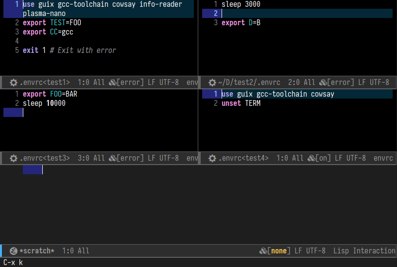

#+title: Envrc - asynchronous buffer-local direnv integration for Emacs

Asynchronous fork of [[https://github.com/purcell/envrc][envrc]].

* Fork additions
Whether to load the environments synchronously or asynchronously can be
configured with the variable ~envrc-async-processing~.

This also refactors the =envrc= lighter to replace it with a mode line
indicator. This indicator introduces two new states:
- A loading state, where a spinner hints buffers that are waiting for the
  environment to load. The widget can be disabled by setting the
  ~envrc-add-to-mode-line-misc-info~ variable to ~nil~.
- And the denied state, to indicate that an environment has been blocked by
  issuing ~direnv deny~.

In order to ease the management of asynchronous processes, a vtable based
process UI has been added. It can me invoked with ~M-x envrc-list-processes~.

It provides a few keybindings for interacting with the processes, they are
defined in ~envrc-list-mode-map~. For now it allows:
- k :: kill the process of the current line
- RET :: follow the element under point, PID, path or buffer. Following the PID
  opens a proced showing the selected process and it's children in a tree form
  (this can be seen in the image below.
- g :: for refreshing the table

The module also provides ~envrc-list-auto-update-flag~ which periodically
refreshes the =envrc= process UI every ~envrc-list-auto-update-interval~.

* Screencast

* Introduction

A GNU Emacs library which uses the [[https://direnv.net/][direnv]] tool
to determine per-directory/project environment variables and then set
those environment variables on a per-buffer basis. This means that when you
work across multiple projects which have ~.envrc~ files, all processes
launched from the buffers "in" those projects will be executed with
the environment variables specified in those files. This allows
different versions of linters and other tools to be used in each
project if desired.

* How does this differ from ~direnv.el~?

[[https://github.com/wbolster/emacs-direnv][direnv.el]] repeatedly
changes the global Emacs environment, based on tracking what buffer
you're working on.

Instead, ~envrc.el~ simply sets and stores the right environment in
each buffer, as a buffer-local variable.

From a user perspective, both are well tested and typically work fine,
but the ~envrc.el~ approach feels cleaner to me.

Additionally, at the time of writing, ~envrc.el~ has early TRAMP support,
while ~direnv.el~ does not.

* Installation

Installable packages are available via MELPA: do
=M-x package-install RET envrc RET=.

Alternatively, [download][]
the latest release or clone the repository, and install
~envrc.el~ with =M-x package-install-file=.

* Usage

Add a snippet like the following at the *bottom of your init.el*:
#+begin_src emacs-lisp
(use-package envrc
  :vc (:url "https://codeberg.org/pastor/envrc")
  :general
  (:keymaps
   'envrc-mode-map
   "C-c e" 'envrc-command-map)
  :config
  (setq envrc-indicator '(" [" (:eval (envrc--status)) "]"))
  :init
  (add-hook 'after-init-hook #'envrc-global-mode 99))
#+end_src

Why must you enable the global mode *late in your startup sequence* like this? 
You normally want ~envrc-mode~ to be initialized in each buffer *before*
other minor modes like ~flycheck-mode~ which might look for
executables. Counter-intuitively, this means that ~envrc-global-mode~
should be enabled *after* other global minor modes, since each
_prepends_ itself to various hooks.

The global mode will only have an effect if =direnv= is installed and
available in the default Emacs ~exec-path~. (There is a local minor
mode ~envrc-mode~, but you should not try to enable this granularly,
e.g. for certain modes or projects, because compilation and other
buffers might not get set up with the right environment.)

Regarding interaction with the mode, see ~envrc-mode-map~, and the
commands ~envrc-reload~, ~envrc-allow~ and ~envrc-deny~. (There's also
~envrc-reload-all~ as a "nuclear" reset, for now!)

In particular, you can enable keybindings for the above commands by
binding your preferred prefix to ~envrc-command-map~ in
~envrc-mode-map~, e.g.

#+begin_src emacs-lisp
(with-eval-after-load 'envrc
  (define-key envrc-mode-map (kbd "C-c e") 'envrc-command-map))
#+end_src

* Troubleshooting

If you find that a particular Emacs command isn't picking up the
environment of your current buffer, and you're sure that ~envrc-mode~
is active in that buffer, then it's possible you've found code that
runs a process in a temp buffer and neglects to propagate your
environment to that buffer before doing so.

A couple of common Emacs commands that suffer from this defect are also
patched directly via advice in ~envrc.el~ — ~shell-command-to-string~
is a prominent example!

The ~inheritenv~ package was designed to handle this case in general.

* Design notes

By default, Emacs has a single global set of environment variables
used for all subprocesses, stored in the ~process-environment~
variable. ~direnv.el~ switches that global environment using values
from ~direnv~ when the user performs certain actions, such as
switching between buffers in different projects.

In practice, this is simple and mostly works very well. But there are
some quirks, and it feels wrong to me to mutate the global environment
in order to support per-directory environments.

Now, in Emacs we can also set ~process-environment~ locally in a
buffer. If this value could be correctly maintained in all buffers
based on their various respective ~.envrc~ files, then buffers across
multiple projects could simultaneously be "connected" to the
environments of their corresponding project directories. I wrote
~envrc.el~ to explore this approach.

~envrc.el~ uses a global minor mode (~envrc-global-mode~) to hook into
practically every buffer created by Emacs, including hidden and
temporary ones. When a buffer is found to be "inside" an
~.envrc~-managed project, ~process-environment~ is set buffer-locally
by running ~direnv~, the results of which are also cached indefinitely
so that this is not too costly overall. Each buffer has a local minor
mode (~envrc-mode~) with an indicator which displays whether or not a
direnv is in effect in that buffer. (Hooking into every buffer is
important, rather than just those with certain major modes, since
separate temporary, compilation and repl buffers are routinely used
for executing processes.)

This approach also has some trade-offs:

* Buffers like ~*Help*~ will have ~envrc-mode~ enabled based on the
  directory of the buffer which caused them to be created initially,
  and then those buffers often live for a long time. If you launch
  programs from such buffers while working on a different project, the
  results might not be what you expect. I might exclude certain modes
  to minimise confusion, but users will always have to be aware of the
  fact that environments are buffer-specific.

* There's a (very small) overhead every time a buffer is created, and
  that happens quite a lot.

* ~direnv~ updates are not automatic. ~direnv.el~ re-executes ~direnv~
  when switching between buffers that visit files in different
  directories, whereas ~envrc-mode~ caches the environment until the
  user refreshes it explicitly with ~envrc-reload~.

Overall this approach works well in practice, and feels cleaner than
trying to strategically modify the global environment.

It's also possible that there's a way to call ~direnv~ more
aggressively by allowing it to see values of ~DIRENV_*~ obtained
previously such that it becomes a no-op.
